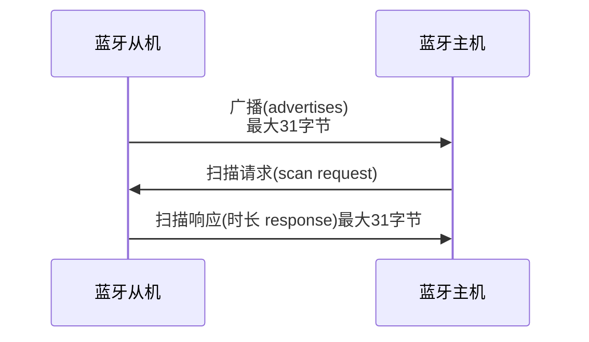

## 蓝牙广播

### 广播信道

>低功耗蓝牙一共有40个信道,频段范围为**2402MHz**到**2480MHz**,每2MHz一个信道,其中37,38,39是广播信道,虽然数字连续,但是为了避免干扰,是分布在不同位置的,如下图所示

看完这张图,你已经了解到ble是在什么频段传输数据和广播了

***

### 广播数据包

>下一步我们需要了解广播会发送什么,长度,格式,如何解析等

>在广播的三个信道上,会广播数据,一个数据包最长37个字节
由mac地址(固定长6个字节)和用户自定义数(37-6,剩下31字节可用)据组成,用户可以使用完,也可以使用一部分,根据协议会自动补0
详情如图

>数据包详情如下, **长度+类型+内容**, 可以由多个此结构体组成,没有用完系统自动补0,长度是不算自己,算(类型+内容的长度),类型固定位一个字节,下图有常用类型对应表,内容可由用户自定义

>注:蓝牙名称使用utf-8编码

***

## 蓝牙广播类型

[太长了不想看,点击跳转一图通](#蓝牙广播类型一图通)

### 可连接的非定向广播 (ADV_IND)
这是一种用途最广，最常见的广播类型，包括 广播数据 和 扫描响应数据，它表示当前设备可以接受任何设备的连接请求。
进行通用广播 的设备能够被扫描设备扫描到，或者在接收到连接请求时作为从设备 进入一个连接。
通用广播 可以在 没有连接的情况下发出，换句话说，没有主从设备之分。

### 可连接的定向广播 (ADV_DIRECT_IND)
定向广播 类型是为了尽可能快的连接，俗称回连包。
这种报文包含两个地址：广播者的地址和发起者的地址。
发起者 收到发给自己的定向广播报文之后，可以立即发送 连接请求作为回应。
定向广播类型有特殊的时序要求。完整的广播时间必须每3.75ms重复一次。这一要求使得扫描设备只需扫描3.75ms 便可以收到定向广播设备的消息。
当然，如此快的发送会让报文充斥着广播信道，进而导致该区域内的其他设备无法进行广播。因此，定向广播不可以持续1.28s以上的时间。如果主机没有主动要求停止，或者连接没有建立，控制器都会自动停止广播。一旦到了1.28s，主机便只能使用间隔长得多的 可连接非定向广播 让其他设备来连接。
当使用定向广播时，设备不能被 主动扫描。此外，定向广播报文的净荷中也不能带有其他附加数据，该净荷只能包含两个必须的地址。

### 不可连接的非定向广播 (ADV_NONCONN_IND)
仅仅发送广播数据，而不想被扫描或者连接。
这也是唯一可用于只有发射机 而没有接收机设备的广播类型。
不可连接设备不会进入 连接态，因此，它只能根据主机的要求在广播态和就绪态之间切换。
常用于 BLE Mesh、Beacon项目。

### 可扫描的非定向广播 (ADV_SCAN_IND)
又称可发现广播，这种广播不能用于发起连接，但允许其他设备扫描该广播设备。
这意味着该设备可以被发现，既可以发送广播数据，也可以响应扫描 发送扫描回应数据，但不能建立连接。
这是一种适用于广播数据的广播形式，动态数据可以包含与广播数据之中，而静态数据可以包含于扫描响应数据之中。

### 蓝牙广播类型一图通
|类型|说明|
|--|--|
|可连接非定向|最常用的广播方式|
|可连接定向|用于快速连接|
|不可连接非定向|用于信标,传感器,比如胎压设备|
|可扫描非定向|比较少用,需要被其它设备主动扫描发现|

>总结就是这两张图,可以开始后面的啦

***

## 扫描响应

用我们的手把和耳机连接举例,
1. (耳机广播事件)耳机没有被连接时,持续发出可连接非定向的广播
2. (手把扫描请求)此时我们手把打开ble扫描
3. (耳机扫描响应)被扫描到时,带上扫描响应数据再次返回到手把扫描的数据包中
4. (手把信息过滤)手把根据扫描拿到的数据包进行分析,哪些是耳机发出的ble,然后根据数据包拿到的耳机ble名称展示搜索列表

也就是最大我们扫描广播,最大能拿到62个字节的数据,当然,扫描响应数据是非必须的,也可以不添加.

***

## 蓝牙一般的5种状态

设备上电,进入就绪态,发起广播,进去广播态,被别的设备连接,就进入连接态,断开连接就会再次回到就绪态,可以在就绪态发起扫描,进入扫描态,发现了想要连接的设备,发起连接,则进入发起态,双方连接成功后,都会进入连接态

***

## 服务和特性(最重要)

蓝牙协议的整体架构,我们主要关注应用层,协议栈一般由芯片原厂完成

负责应用层的我们,怎么实现用ble来完成数据交互呢,主要就是对蓝牙特征值的读写

一个蓝牙设备,可以创建多个服务,每个服务可以创建多个特征,特征可以设置不同的属性(读,写,通知等)

一般对于ble设备的交互过程:
扫描蓝牙设备 -> 连接蓝牙 -> 获取服务 -> 获取特征 ->获取特征属性 ->读写特征值,添加特征值改变监听(需要有通知属性)

如上图所示,我们只需要对特征值进行数据的读写,即可完成数据交互
所以为了能读写某一个特征值,将需要完成以下操作

1. 我们第一步需要正确的找到它,所以,在一个蓝牙设备中,每一个服务和特征,都有一个唯一的uuid,长128bit,但是由于太长不方便,可以使用基地址缩写成16bit的uuid
2. 找到它过后,我们需要确认它的权限,是否可读,可写,或者其它权限
3. 确认好权限后,我们对这个特征值写入数据,服务端将会收到对应的写入事件,再对写入数据进行处理.
4. 当然,假如特征值有noti属性,你也可以选择对此特征值进行监听
***

到了这一步,ble的一套流程已经了解完了,此时,你可能还对这个读写的概念比较模糊,假如你有ble的设备,比如手环等,拿出你的手机,打开微信,搜索谷雨蓝牙调试工具打开

1. 打开后给于蓝牙和定位权限,将会搜索周围的广播并且展示出来,这里用一个手环设备做示范

2. 连接成功后,将会显示手环的各种**服务**,每个服务都有自己的uuid,为什么有些事Unkown Server呢,因为16bit uuid蓝牙官方有一个规范的文档,每一个服务名称都有一个规定的uuid,当然,走私有协议则可以不用考虑它

3. 我们点开这个heart rate服务,发现它有两个特征,每个特征都有属于自己的uuid,和读写,通知等属性,是否和上面学习的对应上了.那么最后一步,协议的交互就是读写监听通知,那这个是心率服务,我们怎么获取到心率呢,请看下一步

4. 我们选择到一个特征值,选择常规视图

5. 进入后,这个特征值的属性是监听,则我们可以监听此特征值
   

6. 这就是监听到的心率,只是被打印成了字符格式,此字符对应的ascii码,就是心率,比如字符I,换成心率则是73
   

7. 我们打开另一个具有读写权限的特征值,会显示一个读取和写入的面板,我们就可以从此特征值,读取数据,或者写入数据,进行交互了
   

***

>到此,你已经对ble了解完毕了,要进一步学习
主要参考的资料有协议文档：
https://www.bluetooth.com/specifications/specs/
以及定义好的数据,比如那些uuid:
https://www.bluetooth.com/specifications/assigned-numbers/ 
