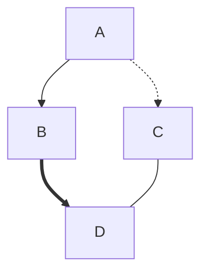
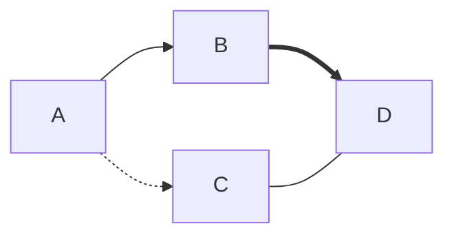
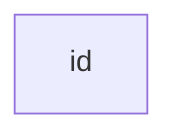
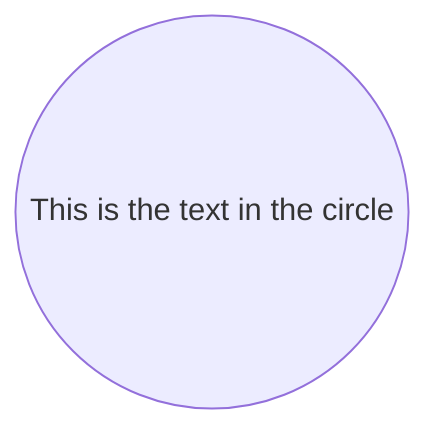
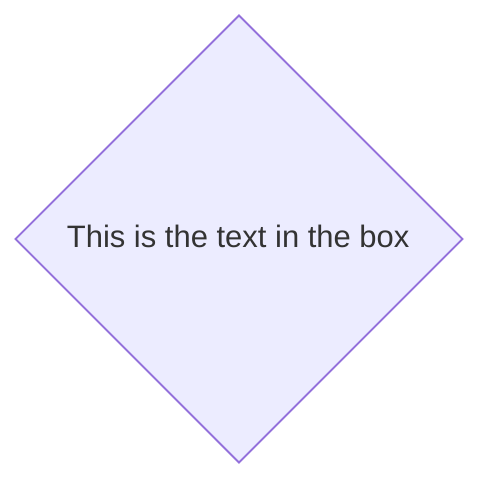

## mermaid流程图

##### eg:代码


##### eg:效果
<center>


</center>

---
### 图表方向
在 graph 的后方添加流程图的显示方向

TB -从上到下
BT - 从下到上
RL - 从右到左
LR - 从左到右
TD - 跟 TB 一样，从上到下

### 节点形状

#### 默认节点方形(直接文字)

<br>
<center>


</center>

---

#### 带文字说明的节点 []

<br>
<center>


</center>

---
#### 圆角矩形 ()

<br>
<center>


</center>

---
#### 圆形 (())

<br>
<center>


</center>

---
#### 飘带结点 >]

<br>
<center>


</center>

---
#### 菱形结点 {}

<br>
<center>


</center>

---
### 节点的连线
结点间可以有不同形式的连接，比如实线，虚线，带箭头的线等

#### 带箭头的线

<br>
<center>


</center>

---
#### 直线

<br>
<center>


</center>

---
#### 在线上有描述文字的线

或者


<br>
<center>

``` mermaid
graph LR
    A-- This is the text ---B
```
或者

``` mermaid
graph LR
    A---|This is the text|B
```
</center>

---
#### 有箭头同时带上文字描述的线
``` mermaid!{.line-numbers}
graph LR
    A-->|text|B
```
或者
``` mermaid!
graph LR
    A-- text -->B
```
<br>
<center>

``` mermaid
graph LR
    A-->|text|B
```
或者
``` mermaid
graph LR
    A-- text -->B
```
</center>

---
#### 虚线带箭头
``` mermaid!{.line-numbers}
graph LR;
   A-.->B;
```
<br>
<center>

``` mermaid
graph LR;
   A-.->B;
```
</center>

---
#### 加粗的线
``` mermaid!{.line-numbers}
graph LR
   A ==> B
```
<br>
<center>

``` mermaid
graph LR
   A ==> B
```
</center>

---
#### 带文字加粗的线
``` mermaid!{.line-numbers}
graph LR
   A == text ==> B
```
<br>
<center>

``` mermaid
graph LR
   A == text ==> B
```
</center>

### 子图表
``` text{.line-numbers}
subgraph 子图表名称
    子图表中的描述语句...
end
```

``` mermaid!{.line-numbers}
graph TB
    c1-->a2
    subgraph one
    a1-->a2
    end
    subgraph two
    b1-->b2
    end
    subgraph three
    c1-->c2
    end
```
<center>

``` mermaid
graph TB
    c1-->a2
    subgraph one
    a1-->a2
    end
    subgraph two
    b1-->b2
    end
    subgraph three
    c1-->c2
    end
```
</center>

---

### 结点样式自定义
``` mermaid!{.line-numbers}
graph LR
    id1(Start)-->id2(Stop)
    style id1 fill:#f9f,stroke:#333,stroke-width:4px
    style id2 fill:#ccf,stroke:#f66,stroke-width:2px,stroke-dasharray: 5, 5
```
<br>
<center>

``` mermaid
graph LR
    id1(Start)-->id2(Stop)
    style id1 fill:#f9f,stroke:#333,stroke-width:4px
    style id2 fill:#ccf,stroke:#f66,stroke-width:2px,stroke-dasharray: 5, 5
```
</center>

---