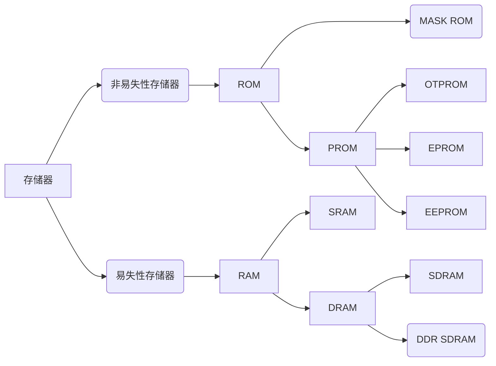

# ROM 和 RAM的区别

先要明确一个基本概念,rom 和 ram 都是半导体存储器,rom 一般就是我们接触的大的存储空间,掉电依旧能保存数据,ram 则是我么接触的运行内存,速度快,掉电后就会丢失数据

## 快捷目录

- [[#ROM 非易失性存储器|ROM 非易失性存储器]]
	- [[#ROM 非易失性存储器#MASK ROM|MASK ROM]]
	- [[#ROM 非易失性存储器#OTPROM|OTPROM]]
	- [[#ROM 非易失性存储器#EPROM|EPROM]]
	- [[#ROM 非易失性存储器#EEPROM|EEPROM]]
	- [[#ROM 非易失性存储器#FLASH|FLASH]]
- [[#RAM 易失性存储器|RAM 易失性存储器]]
	- [[#RAM 易失性存储器#SRAM|SRAM]]
	- [[#RAM 易失性存储器#DRAM|DRAM]]
	- [[#RAM 易失性存储器#SDRAM|SDRAM]]
	- [[#RAM 易失性存储器#DDR SDRAM|DDR SDRAM]]

## ROM 非易失性存储器

### MASK ROM

MASK(掩膜) ROM就是正宗的“Read Only Memory”，存储在它内部的数据是在出厂时使用特殊工艺固化的，生产后就不可修改， 其主要优势是大批量生产时成本低。当前在生产量大，数据不需要修改的场合，还有应用。

---

### OTPROM

OTPROM(One Time Programable ROM)是一次可编程存储器。这种存储器出厂时内部并没有资料， 用户可以使用专用的编程器将自己的资料写入，但只能写入一次，被写入过后，它的内容也不可再修改。 在NXP公司生产的控制器芯片中常使用OTPROM来存储密钥;

---

### EPROM

EPROM(Erasable Programmable ROM)是可重复擦写的存储器， 它解决了PROM芯片只能写入一次的问题。这种存储器使用紫外线照射芯片内部擦除数据， 擦除和写入都要专用的设备。现在这种存储器基本淘汰，被EEPROM取代。

---

### EEPROM

EEPROM(Electrically Erasable Programmable ROM)是电可擦除存储器。 EEPROM可以重复擦写，它的擦除和写入都是直接使用电路控制， 不需要再使用外部设备来擦写。而且可以按字节为单位修改数据，无需整个芯片擦除。现在主要使用的ROM芯片都是EEPROM。

---

### FLASH

FLASH存储器又称为闪存，它也是可重复擦写的储器，部分书籍会把FLASH存储器称为FLASH ROM，但它的容量一般比EEPROM大得多， 且在擦除时，一般以多个字节为单位。如有的FLASH存储器以4096个字节为扇区，最小的擦除单位为一个扇区。根据存储单元电路的不同， FLASH存储器又分为NOR FLASH和NAND FLASH

| 特点     | NOR Flash                              | NAND Flash                               |
| -------- | -------------------------------------- | ---------------------------------------- |
| 存储结构 | 按字节方式组织                         | 按页或块方式组织                         |
| 读取速度 | 较快的随机读取速度                     | 顺序读取和写入速度更快                   |
| 擦写速度 | 比较慢，以字节为单位进行擦除           | 擦写速度更快，以块为单位进行擦除         |
| 寿命     | 擦写寿命相对较短                       | 具有较长的擦写寿命                       |
| 应用场景 | 适用于需要快速随机访问和执行代码的场景 | 主要用于大容量存储、多媒体数据传输等应用 |

所以 
NOR Flash 应用一些需要快速随机访问的场景,比如手机系统的存放,嵌入式系统的存放
NAND Flash 则一般用在固态硬盘,存储卡,手机存储等上

---

## RAM 易失性存储器

### SRAM

静态随机存储器SRAM的存储单元以锁存器来存储数据。 这种电路结构不需要定时刷新充电，就能保持状态(当然，如果断电了，数据还是会丢失的)，所以这种存储器被称为“静态(Static)”RAM。
SRAM根据其通讯方式也分为同步(SSRAM)和异步SRAM，相对来说，异步SRAM用得比较广泛。

---

### DRAM

动态随机存储器DRAM的存储单元以电容的电荷来表示数据，有电荷代表1，无电荷代表0。 但时间一长，代表1的电容会放电，代表0的电容会吸收电荷，因此它需要定期刷新操作，这就是“动态(Dynamic)”一词所形容的特性。 刷新操作会对电容进行检查，若电量大于满电量的1/2，则认为其代表1，并把电容充满电；若电量小于1/2，则认为其代表0，并把电容放电，藉此来保证数据的正确性。

---

### SDRAM
在 DRAM 的基础上,在传输数据时,需要系统时钟同步,以此来提高传输效率
工作频率通常为几百 mhz 到 1ghz 范围内

---

### DDR SDRAM

为了进一步提高SDRAM的通讯速度，人们设计了DDR SDRAM存储器(Double Data Rate SDRAM)。它的存储特性与SDRAM没有区别， 但SDRAM只在上升沿表示有效数据，在1个时钟周期内，只能表示1个有数据；而DDRSDRAM在时钟的上升沿及下降沿各表示一个数据， 也就是说在1个时钟周期内可以表示2位数据，在时钟频率同样的情况下，提高了一倍的速度。至于DDR2和DDR3,4,5,6 等 它们的通讯方式并没有区别，主要是通讯同步时钟的频率提高了。在频率,传输速度,功耗上有所提升

电脑的内存条一般使用这个来实现,一个内存条上,多个 ddr sdram 的芯片

---

| 特性     | DRAM | SRAM |
| ------ | ---- | ---- |
| 存取速度   | 较慢   | 较快   |
| 集成度    | 较高   | 较低   |
| 生产成本   | 较低   | 较高   |
| 是否需要刷新 | 是    | 否    |

---

你已经基础了解这些了,只需要基础 rom 是存储空间,ram 是运行空间就够啦